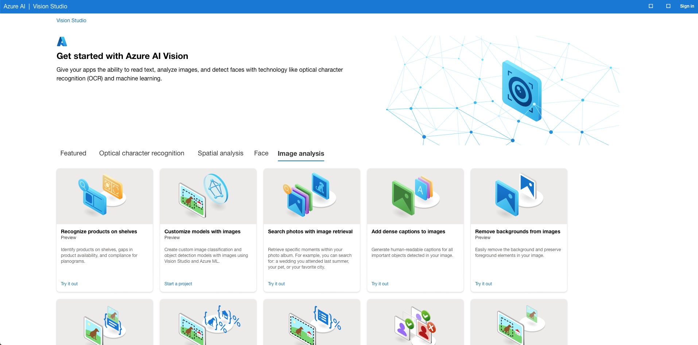

# Artificial Intelligence and Journalism 

Materials and notes from the seminar on "Harnessing Ai In Journalism: Ethical, Practical, And Transformational Approaches”

## Conversational AI 

| Tool            | URL                           | Note                                                         | Fees                                           |
| --------------- | ----------------------------- | ------------------------------------------------------------ | ---------------------------------------------- |
| ChatGPT         | https://chatgpt.com           | Open AI Models: GPT-4o, GPT-4, and GPT-3.5                   | Free and Paid (Pro) options                    |
| HuggingChat     | https://huggingface.co/chat/  | You can select models such as Meta LLama3,HuggingFace Zephyer,Mistralai Mixtral, Microsoft Phi-3, and Google Gemma. Includes option for **Search Web**. *<u>See below for more details.</u>* | Free                                           |
| Le Chat Mistral | https://chat.mistral.ai/chat/ | Mistral Ai models                                            | Free                                           |
| Gemini          | https://gemini.google.com/app | Google Gemini                                                | Gemini is Free with Gemini Advanced being Paid |

## Searching

| Tool                                | URL                          | Note                                                         | Fees                                       |
| ----------------------------------- | ---------------------------- | ------------------------------------------------------------ | ------------------------------------------ |
| Perplexity AI                       | https://www.perplexity.ai    | Like Google Search but utilizing GPT for summary, and provides References. Provides citation for each summary. **Best Option in this category** | Free with an option for a Paid Pro version |
| HuggingChat with Search Web enabled | https://huggingface.co/chat/ | With Search Web enabled it will provide references for web resources | Free                                       |
| Microsoft Copilot (Bing)            |                              | Using Microsoft Edge for Bing Search and Copilot             | Free                                       |
| ChatGPT GPT-4o                      | https://chatgpt.com          | You can instruct the model to search the web and it will provide a search summary. | Free and Paid (Pro) options                |
| Claudi ai                           | https://claude.ai/chat/      | Anthropic Claud Ai                                           | Free and a Paid Pro option (Claud 3 Opus)  |

## Research and Summarization 

| Tool                     | URL                                                 | Note                                                         | Fees                                                         |
| ------------------------ | --------------------------------------------------- | ------------------------------------------------------------ | ------------------------------------------------------------ |
| Google Journalist Studio | https://journaliststudio.google.com                 | A collection of tools to empower journalists to do their work more efficiently, creatively, and securely | Free                                                         |
| Google Pinpoint          | https://journaliststudio.google.com/pinpoint/about/ | A tool to Explore and analyze large collections of documents using the best of Google’s Search and AI technology. Great tool to upload all your data collection from PDF, Audio, Video, and other file formats to enable searching, annotation, of all your content with ease.   *<u>See below for more details.</u>* | Free                                                         |
| Scispace                 | https://typeset.io                                  | Provides capabilities for Literature search, Ask Questions on PDF, Extract Data, and Paraphraser | Free Basic option, Premium Paid, and a University Paid version |
| QuillBot                 | https://quillbot.com                                | Provides capabilities for Summarization, Paraphraser, Grammar Checker, AI Detector, Plagiarism Checker, Translator, Citation Generator. | Free basic version and a Paid premium                        |
| PopAI                    | https://www.popai.pro/                              | Allows you to upload your PDF files to chat with the content for summary, Q&A as well as creating a presentation with citation/references | Free basic version and a Paid Pro version                    |
| Sharly                   | https://sharly.ai                                   | Allows you to upload your PDF files to chat with the content for summary and Q&A | Free basic version, Paid Pro version, and a Paid Business Version |

## Note Taking with AI

| Tool   | URL                   | Note                                                         | Fees                       |
| ------ | --------------------- | ------------------------------------------------------------ | -------------------------- |
| Notion | https://www.notion.so | A **Desktop**, **Web**, and **Mobile** application that allows you to capture notes, organize your thoughts and content, embed videos, PDFs, and other content.   Notion has AI enabled capabilities including Summarization, creating content, Q&A, Translation, Improve Writing, Spelling and Grammar checking, and create content for blog posts, essay, poem, to-do list, creative story, press release and more.   Notion provides browser extension “**Notion Web Clipper**” for Chrome, Safari, and Firefox to extract and convert content from the web into notion (editable) that you can then summarize and read-offline. | Free with Paid Pro version |

* Notion for Beginners Video (YouTube): https://www.youtube.com/watch?v=hbxQw4LQwws
* Intro to Notion AI (YouTube Video 1): https://www.youtube.com/watch?v=30yNRO1X7wY
* Intro to Notion AI (YouTube Video 2): https://www.youtube.com/watch?v=FElBbgnNtVA

## Making Presentation with AI

| Tool         | URL                                            | Note                                                         | Fees                                                         |
| ------------ | ---------------------------------------------- | ------------------------------------------------------------ | ------------------------------------------------------------ |
| Beautiful.ai | https://www.beautiful.ai                       | Create presentations that can be downloaded into PPT (editable) using AI for content creation | Free limited version, Paid Pro version, and a Paid Team version. If you have Student Email you can get access to Pro for free. |
| PopAI        | https://www.popai.pro/                         | Allows you to upload your PDF files to chat with the content for summary, Q&A as well as creating a presentation with citation/references | Free basic version and a Paid Pro version                    |
| Canva        | https://www.canva.com/create/ai-presentations/ | AI presentation Maker                                        | Free basic version, Paid Pro version, and a Paid Team version |

# Other Demos

### Azure Cognitive AI - Vision Studio

A great place to explore different AI Vision capabilities 

https://portal.vision.cognitive.azure.com/gallery/imageanalysis

### Azure Cognitive AI - Language Studio

https://language.cognitive.azure.com

A great place to explore different AI Language capabilities 

### Azure AI Studio

A great place to explore different AI capabilities offered by Azure including Content Moderation (Safery), Vision, Language, and Speech 

https://ai.azure.com/explore/aiservices

### Google PinPoint

https://journaliststudio.google.com/pinpoint/about/

* Google PinPoint Training : https://newsinitiative.withgoogle.com/resources/products/pinpoint/
* PinPoint how to use: https://newsinitiative.withgoogle.com/resources/trainings/pinpoint-a-research-tool-for-journalists/
* How to use PinPoint (YouTube Video): https://www.youtube.com/watch?v=Dt7g-0TcbLY

### HuggingFace

A great place to explore a huge selection of Open-Source Models

https://huggingface.co/models

### HuggingChat

**NOTE**

***There is an option to switch the model. When you click it will show you options to switch to different models***

You can switch models including:

* CohereForAI/c4ai-command-r-plus
* meta-llama/Meta-LLama-3-70b-instruct
* HuggingFaceH4/zephyer-orpo-141b-A345b-v0.1
* mistralai/Mixtral-8x7B-instruct-v0.1
* NousResearch/Nous-Hermes-2-Mixtral-8x7B-DPO, 01-ai/Yi-1.5-34B-Chat
* google/gemma-1.1-7b-it, mistralai/Mistral-7B-instruct-v0.2
* Microsoft/Phi-3-mini-4k-instruct

**You can enable `Search Web` feature**

### 
